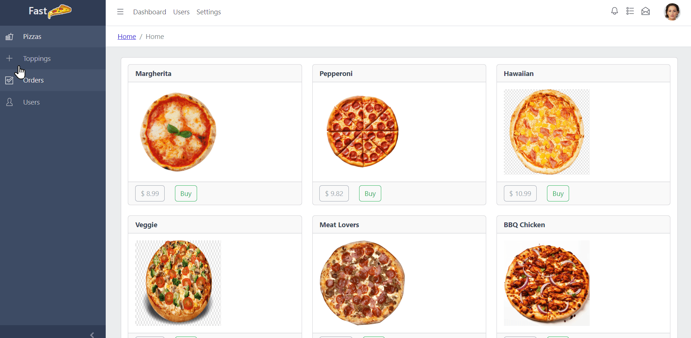

# Project
spring boot learning project

# Requirements
- Java 17
- Node 20
- Apache Maven 3.9.0

# Deploy
To deploy the application you need to run this command: 
```
mvn spring-boot:run
```
Then you need to open this url [http://localhost:8080](http://localhost:8080)

# Demo


# Arquitecture
## MVC
This application generally employs the MVC (Model-View-Controller) pattern. The View component is implemented using a React application, while both the Controller and Model components are represented by a Spring Boot API.


## React
<br/>
The React application utilizes Core UI as the boilerplate for the project. It leverages Axios for API communication, React Router for page navigation, and Redux for state management.

## SpringBoot
<br/>
The Spring Boot API relies heavily on Spring Data REST to construct endpoints based on repositories. Information is stored in an in-memory database known as [H2](https://www.h2database.com/html/main.html). JPA is utilized for creating entities, and Swagger has been integrated to provide the API documentation.

# Notes (Things to improve)
Approximately six hours were dedicated to the exercise. Given more time, the following areas could be further improved:

## Building process
The repository includes the build folder generated by the React project, which is not considered good practice. A better approach would be to create a script to handle the build process, such as:
```
cd webapp
npm install
npm run build
cp -rf build ../src/main/resources/
# Additional commands as needed
```
Alternatively, an even more robust solution would be to create a docker-compose.yml file to define services for both the Spring Boot and React applications. This would facilitate a cleaner separation of concerns and easier deployment.

## Swagger Documentation
The Swagger documentation could be enhanced by incorporating the APIs generated by Spring Data REST and by adding annotations to supplement the information.

## Security
The core UI boilerplate already includes a login page, which we can enhance by integrating JWT authentication and Spring Security into the API.

## Code
The code contains several deficiencies that can be addressed through the following actions:

- Reformat all files to ensure consistent styling and readability.
- Eliminate all superfluous boilerplate code that is no longer required.
- Remove all unnecessary imports to streamline the codebase.
- Delete the 'build' folder located within the Spring Boot resources and set up a script to generate it automatically.


## Testing
The major shortcoming of this demo app is the absence of JUnit for the backend and Jest for the frontend.

## Publish
Finally could be a good idea to publish the app using heroku, EBS, EKS, or a tiny EC2 instance.
